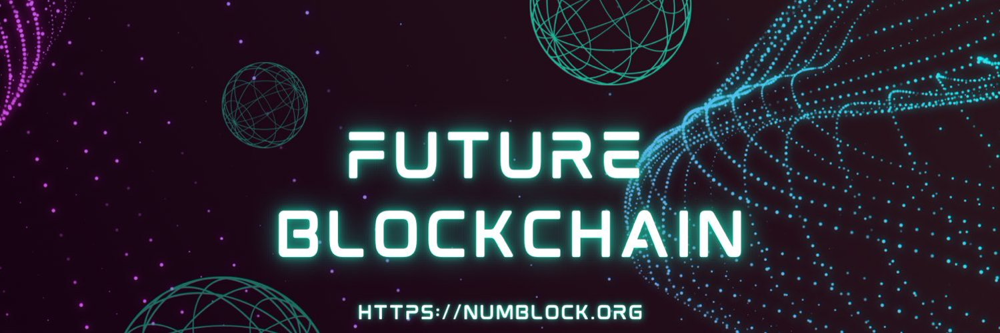

## NumBlock

NumBlock is a modular, extensible and EVM compatible blockchain. A solid blockchain foundation for scalable and speedy success!!!

To find out more about NumBlock, visit the [official website](https://numblock.org/).

## Documentation 📝

If you'd like to learn more about the NumBlock how it works and how you can use it for your project,
please check out the **[NumBlock Documentation](https://docs.numblock.org/)**.

---

Copyright 2023 NumBlock

Licensed under the Apache License, Version 2.0 (the "License");
you may not use this file except in compliance with the License.
You may obtain a copy of the License at

       http://www.apache.org/licenses/LICENSE-2.0

Unless required by applicable law or agreed to in writing, software
distributed under the License is distributed on an "AS IS" BASIS,
WITHOUT WARRANTIES OR CONDITIONS OF ANY KIND, either express or implied.
See the License for the specific language governing permissions and
limitations under the License.
